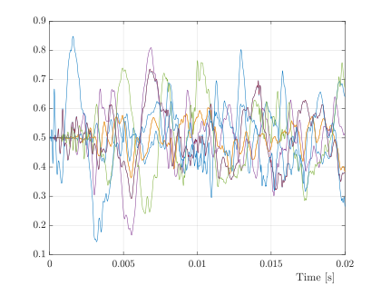

<!--
*** Thanks for checking out the Best-README-Template. If you have a suggestion
*** that would make this better, please fork the repo and create a pull request
*** or simply open an issue with the tag "enhancement".
*** Thanks again! Now go create something AMAZING! :D
***
***
***Cancel changes
*** To avoid retyping too much info. Do a search and replace for the following:
*** github_username, repo_name, twitter_handle, email, project_title, project_description
-->


<!-- PROJECT SHIELDS -->
<!--
*** I'm using markdown "reference style" links for readability.
*** Reference links are enclosed in brackets [ ] instead of parentheses ( ).
*** See the bottom of this document for the declaration of the reference variables
*** for contributors-url, forks-url, etc. This is an optional, concise syntax you may use.
*** https://www.markdownguide.org/basic-syntax/#reference-style-links
-->
[![Contributors][contributors-shield]][contributors-url]
[![Forks][forks-shield]][forks-url]
[![Stargazers][stars-shield]][stars-url]
[![Issues][issues-shield]][issues-url]
[![MIT License][license-shield]][license-url]
[![LinkedIn][linkedin-shield]][https://www.linkedin.com/in/danieldelrv/]


<!-- PROJECT LOGO -->
<br />
<p align="center">
  <a href="https://github.com/Danieldelriovelilla/CE2.git">
    
  </a>

  <h3 align="center">Caso de Estudio 2</h3>

  <p align="center">
  En este repositorio se reocge todo el desarrollo de la asignatura Caso de Estudio 2 del Máster Universitario en Sistemas Espaciales (Instituto de Investigación Ignacio da Riva, Universidad Politécnica de Madrid).
  <br />
    <a href="https://github.com/Danieldelriovelilla/CE2"><strong>Explore the docs »</strong></a>
    <br />
    <br />
    <a href="https://github.com/Danieldelriovelilla/CE2.git">View Demo</a>
    ·
    <a href="https://github.com/Danieldelriovelilla/CE2/issues">Report Bug</a>
    ·
    <a href="https://github.com/Danieldelriovelilla/CE2/issues">Request Feature</a>
  </p>
</div>


<!-- TABLE OF CONTENTS -->
<details open="open">
  <summary><h2 style="display: inline-block">Índice</h2></summary>
  <ol>
    <li>
      <a href="#Sobre-el-proyecto">Sobre el proyecto</a>
      <ul>
        <li><a href="#Organización-de-carpetas">Organización de carpetas</a></li>
      </ul>
    </li>
    <li>
      <a href="#Code">Code</a>
      <ul>
        <li><a href="#Matlab">Matlab</a></li>
        <li><a href="#Python">Python</a></li>
      </ul>
    </li>
    <li><a href="#Documentation">Documentation</a></li>
    <li><a href="#Presentacion">Presentacion</a></li>
    <li><a href="#Report">Report</a></li>
    <li><a href="#Agradecimientos">Agradecimientos</a></li>
  </ol>
</details>


<!-- ABOUT THE PROJECT -->
## Sobre el proyecto

<!-- [![Product Name Screen Shot][product-screenshot]](https://example.com) -->

Este trabajo consiste en constrtuir una herramienta de Structural Health Monitoring, (SHM), con dos objetivos principales: localización y caracterización energética de imapctos.

La herramienta utilizada se ha desarrollado en Python utilizadno la librería PyTorch. Sin embargo, todo el procesado de datos se ha realizado mediante software en MATLAB. 


### Organización de carpetas

La estructura de carpetas en la que se divide el repositorio es la siguiente, que se detallará una por una más adelante.

* [Code](https://github.com/Danieldelriovelilla/CE2/tree/main/Code)
* [Documentation](https://github.com/Danieldelriovelilla/CE2/tree/main/Documentation)
* [Presentation](https://github.com/Danieldelriovelilla/CE2/tree/main/Presentacion)
* [Readme_Folder](https://github.com/Danieldelriovelilla/CE2/tree/main/Readme_Folder)
* [Report](https://github.com/Danieldelriovelilla/CE2/tree/main/Report)

<p align="right">(<a href="#top">back to top</a>)</p>


<!-- CODE -->
## [Code](https://github.com/Danieldelriovelilla/CE2/tree/main/Code)

En esta carpeta se encuentra el software desarollado. Se divide en dos subcarpetas, Matlab y Python, ya que el trabajo se han utilizado ambos lenguajes.


### [Matlab](https://github.com/Danieldelriovelilla/CE2/tree/main/Code/Matlab)
Esta carpeta contiene los códigos utilizados para procesar los impactos y obtener los resultados del funcionamiento de la herramienta.

* [Impact_Config](https://github.com/Danieldelriovelilla/CE2/tree/main/Code/Matlab/Impact_Config) 
  
  Código de reducción dimensional.
* [Process_Impacts](https://github.com/Danieldelriovelilla/CE2/tree/main/Code/Matlab/Process_Impacts)

  Programas para procesar los impactos y juntarlos un una única matriz
* [Results](https://github.com/Danieldelriovelilla/CE2/tree/main/Code/Matlab/Results)

  Programas para obtener los resultados del funcionamiento de las redes desarrolladas.
* [t-SNE](https://github.com/Danieldelriovelilla/CE2/tree/main/Code/Matlab/t-SNE)

  Pruebas para hacer reducción dimensional con los impactos.


### [Python](https://github.com/Danieldelriovelilla/CE2/tree/main/Code/Matlab)
Esta carpeta contiene el desarrollo del modelo de Deep Learning con PyTorch.

* [DL](https://github.com/Danieldelriovelilla/CE2/tree/main/Code/Python/DL) 
  
  Pruebas de reducción dimensional y extracción de características.
* [Data_Preparation_4_ML](https://github.com/Danieldelriovelilla/CE2/tree/main/Code/Python/Data_Preparation_4_ML)

  Pruebas de diferentes algoritmos de preparación de datos para Machine Learning.
* [Impacts_Code_Developpement](https://github.com/Danieldelriovelilla/CE2/tree/main/Code/Python/Impacts_Code_Developpment)

  Pruebas de redes en local.
  
Los modelos finales utilizados se pueden encontrar en la siguiente carpeta compartida de Drive.
```sh
  https://drive.google.com/drive/folders/1yNxO625r8JCTOUuzdgK5sJzlRZNtvN7R?usp=sharing
```
  
<p align="right">(<a href="#top">back to top</a>)</p>  


<!-- Documentation -->
## [Documentation](https://github.com/Danieldelriovelilla/CE2/tree/main/Documentation)
Todos los libros y artículos que se han utilizado en el trabajo.


<!-- Presentacion -->
## [Presentacion](https://github.com/Danieldelriovelilla/CE2/tree/main/Presentacion)
Ppt realizada para la presentación del trabajo. Aquí se encuentran las fotos y vídeos que se han utlizado.


<!-- Report -->
## [Report](https://github.com/Danieldelriovelilla/CE2/tree/main/Report)
Informe escrito y todas las imágenes tuilizadas.


<!-- Agradecimientos -->
## Agradecimientos
Especial agradecimiento a:

* [Andrés Pedraza](https://github.com/temisAP)


<!-- MARKDOWN LINKS & IMAGES -->
<!-- https://www.markdownguide.org/basic-syntax/#reference-style-links -->
[contributors-shield]: https://img.shields.io/github/contributors/github_username/repo.svg?style=for-the-badge
[contributors-url]: https://github.com/github_username/repo/graphs/contributors
[forks-shield]: https://img.shields.io/github/forks/github_username/repo.svg?style=for-the-badge
[forks-url]: https://github.com/github_username/repo/network/members
[stars-shield]: https://img.shields.io/github/stars/github_username/repo.svg?style=for-the-badge
[stars-url]: https://github.com/github_username/repo/stargazers
[issues-shield]: https://img.shields.io/github/issues/github_username/repo.svg?style=for-the-badge
[issues-url]: https://github.com/github_username/repo/issues
[license-shield]: https://img.shields.io/github/license/github_username/repo.svg?style=for-the-badge
[license-url]: https://github.com/github_username/repo/blob/master/LICENSE.txt
[linkedin-shield]: https://img.shields.io/badge/-LinkedIn-black.svg?style=for-the-badge&logo=linkedin&colorB=555
[linkedin-url]: https://linkedin.com/in/github_username
